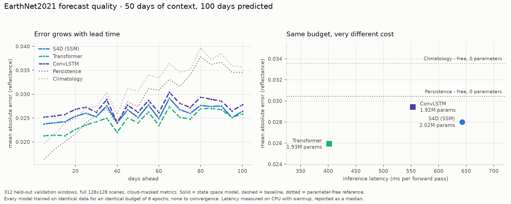
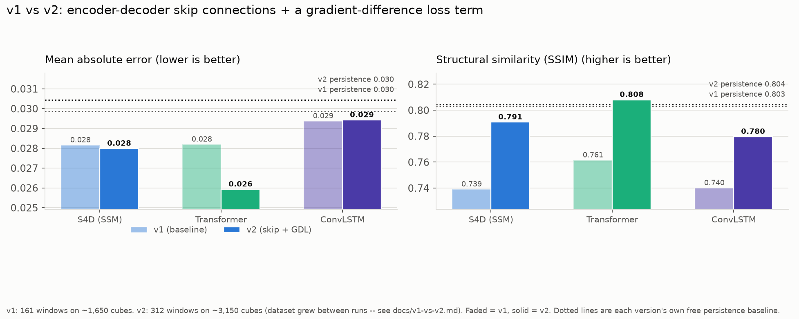
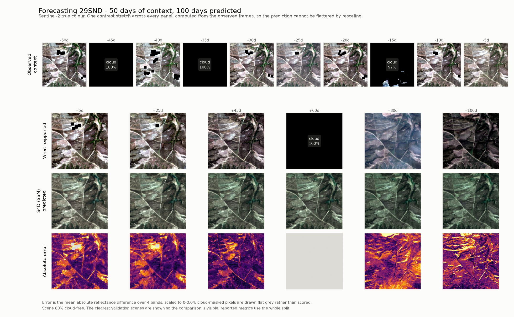
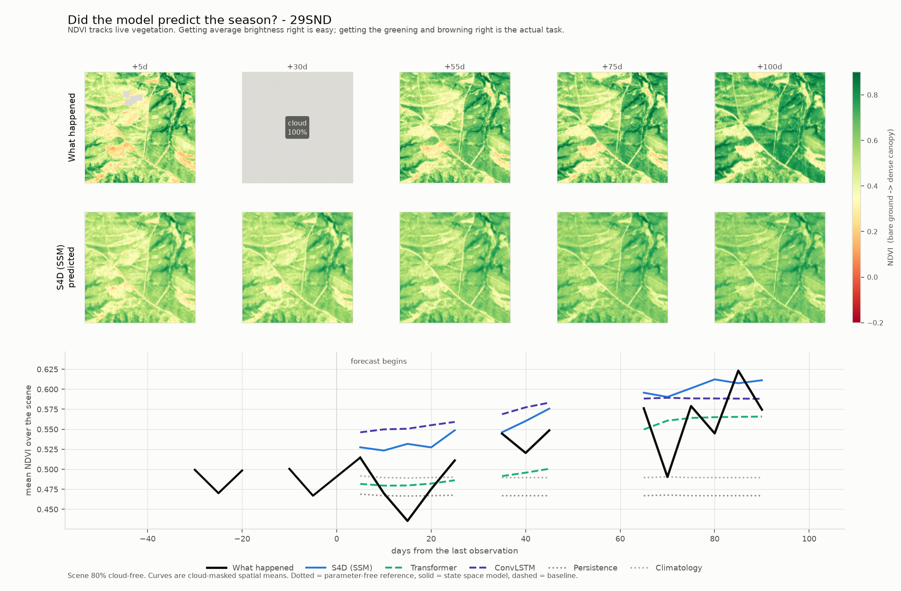
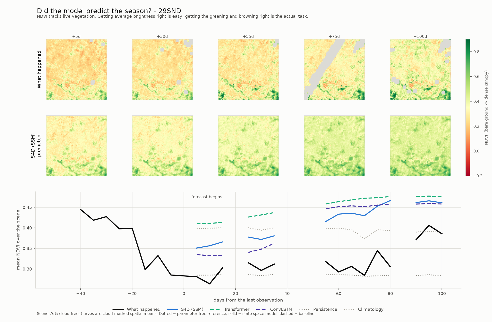
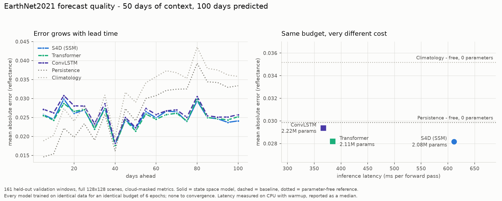
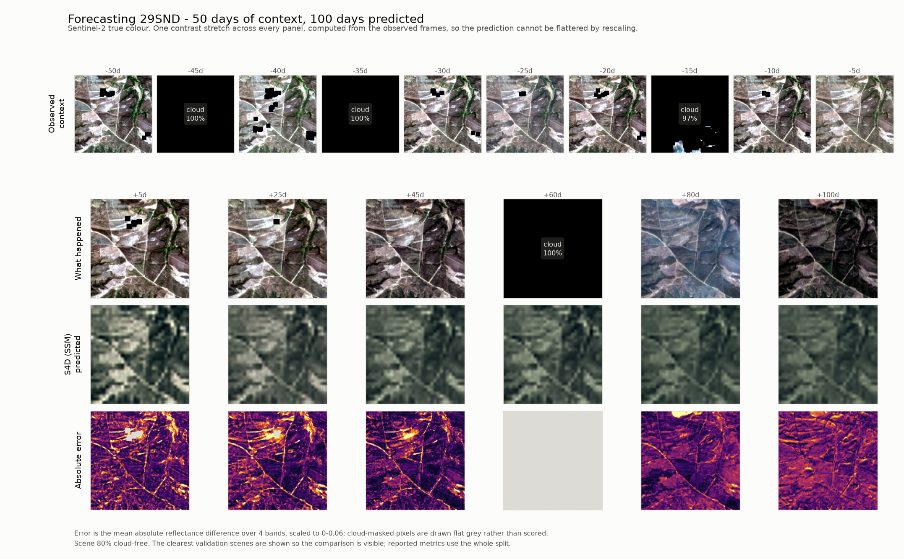
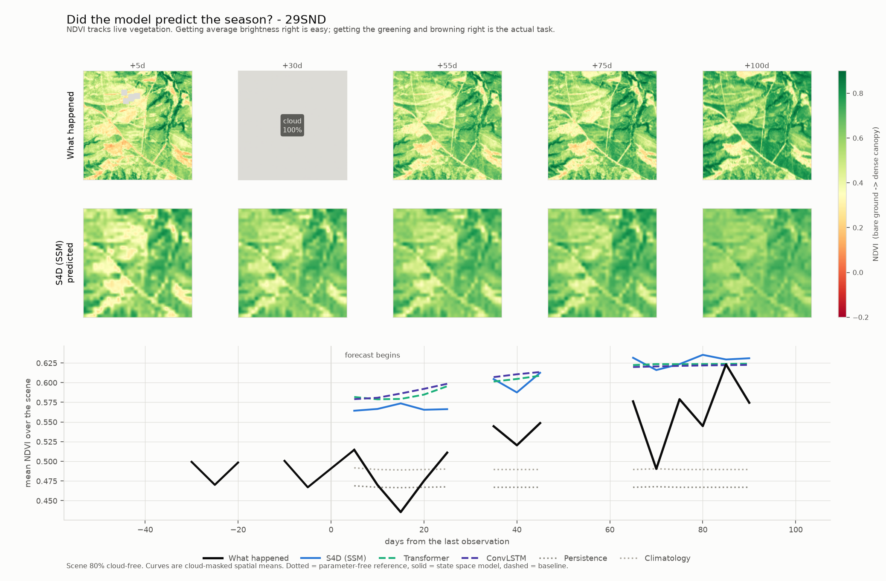
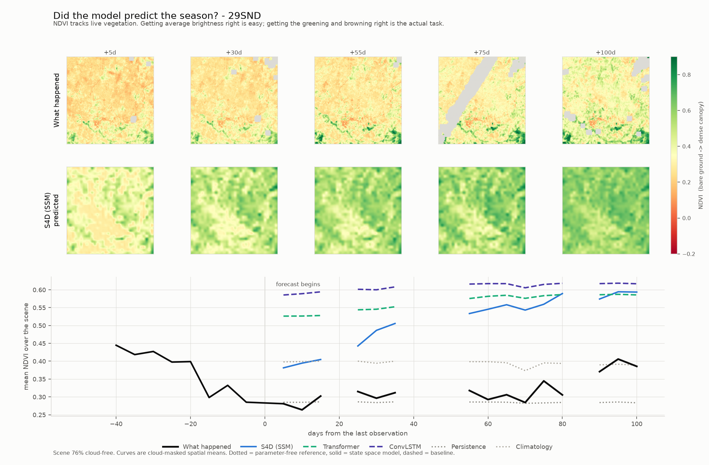

# TinyEarth

**A controlled benchmark for measuring how small a State Space Model can get before it stops
forecasting the Earth's surface competitively.**

Four temporal architectures — a diagonal SSM, a selective SSM, a ConvLSTM and a temporal
transformer — swappable by one config flag, compared at **matched parameter budgets**. Every
backbone trains under two **architecture versions**: **v1**, the baseline encoder/decoder, and
**v2**, which adds encoder-to-decoder skip connections and a gradient-difference (GDL) loss
term on top of the same backbones. Both versions are trained, evaluated and reported below —
this document leads with v2, the current architecture, and reports v1 alongside it as the
baseline v2 is measured against, not as a historical footnote.

```
image encoder  ─→  temporal backbone  ─→  decoder  ─→  forecast
                   ▲
                   the only thing that changes between experiments
```

The encoder and decoder keep **byte-identical parameter counts** across every backbone swap,
within a given architecture version. That invariant is what makes a difference attributable to
the architecture rather than to accidental capacity — and it is enforced by tests, not by
convention.

```bash
pip install -e ".[dev]"
tinyearth-train +experiment=ssm_smoke      # trains end to end in seconds, no dataset needed
```

---

## Results: v2 (skip connections + GDL) — the current architecture

312 held-out validation windows, official EarthNet2021 protocol (10 Sentinel-2 frames / 50
days of context, 20 frames / 100 days predicted), scored at full 128×128 resolution.
**Mamba is excluded** — see [why](#why-mamba-is-excluded-from-both-versions) below.

| Backbone | MAE ↓ | RMSE ↓ | PSNR ↑ | SSIM ↑ | SAM ↓ | latency | parameters |
| --- | --- | --- | --- | --- | --- | --- | --- |
| **Transformer** | **0.02593** | **0.03925** | **28.47** | **0.8081** | **6.06** | 401 ms | 1,930,908 |
| S4D (SSM) | 0.02799 | 0.04207 | 27.87 | 0.7908 | 6.40 | 642 ms | 2,023,548 |
| ConvLSTM | 0.02943 | 0.04396 | 27.47 | 0.7796 | 6.40 | 553 ms | 1,920,420 |
| *Persistence (free)* | *0.03045* | *0.04661* | *27.08* | *0.8044* | *6.36* | *free* | *0* |
| *Climatology (free)* | *0.03358* | *0.04921* | *26.52* | *0.7932* | *7.08* | *free* | *0* |

**Transformer is the clear model of choice under v2** — best on every quality metric *and* the
cheapest of the three at 401 ms. v1 had S4D and Transformer in a near-tie; v2 does not.

<picture>
  <source media="(prefers-color-scheme: dark)" srcset="docs/figures/quality-v2-dark.png">
  
</picture>

### What v2 changes, and nothing else

1. **Encoder-to-decoder skip connections.** The encoder's last-observed-context-frame features
   are fused into the decoder at every resolution level, giving the decoder a full-resolution
   reference for "what things looked like most recently" instead of reconstructing detail
   purely from the backbone's compressed latent. Implemented in the shared `Encoder`/`Decoder`
   base classes — not per backbone — so it applies identically to all three and adds a fixed
   43,232 parameters regardless of which backbone sits underneath. See
   [`docs/models.md`](docs/models.md) for the design.
2. **A gradient-difference (GDL) loss term**, added *alongside* L1, not in place of it. GDL
   compares gradient **magnitude** between prediction and target rather than raw pixel values —
   exactly the thing L1 cannot see, and exactly what makes a forecast look blurred even when its
   mean pixel value is right.
3. Protocol, crop size, epoch budget, optimiser and schedule are all **identical to v1**.
   Architecture is the variable this comparison isolates — modulo the dataset-size caveat
   below, which is the one thing that isn't isolated.

Full rationale: [`docs/v1-vs-v2.md`](docs/v1-vs-v2.md) and
[`configs/experiment/earthnet_v2.yaml`](configs/experiment/earthnet_v2.yaml).

#### Why Mamba is excluded from both versions

Its selective scan is a sequential Python loop with no fused kernel on this platform — ~5× S4D's
per-step cost in v1, measured, and flat in batch size, so no batching trick recovers it. v2 adds
cost on top of every backbone (GDL's extra gradient, the skip pathway's extra convolutions),
which does not improve Mamba's relative position. Carried forward as a decision, not silently
re-made: see `docs/project-log.md` Phase 5 and Phase 6.

### v2 against v1, every metric, side by side

| Backbone | ΔMAE | ΔRMSE | ΔPSNR | ΔSSIM | ΔSAM | Δlatency | Δparameters |
| --- | --- | --- | --- | --- | --- | --- | --- |
| S4D | −0.6% | +0.1% | +0.0% | **+7.0%** | −9.9% | +5.1% | −2.6% |
| Transformer | **−8.0%** | **−7.5%** | +2.2% | **+6.1%** | −12.9% | +4.5% | −8.6% |
| ConvLSTM | +0.2% | +0.1% | −0.3% | **+5.3%** | −13.0% | **+50.8%** | −13.6% |

<picture>
  <source media="(prefers-color-scheme: dark)" srcset="docs/figures/v1-vs-v2-dark.png">
  
</picture>

Four things in that table are worth reading individually rather than skimming as a block:

**SSIM improved for every backbone** (+5.3% to +7.0%), while MAE moved by smaller amounts in
*both* directions. That is the signature of a term that targets blur specifically rather than
accuracy generally, and it is consistent regardless of the dataset-size caveat below, since it
holds in the same direction for all three backbones. **v2 Transformer is the first model in
either version to beat the persistence baseline on SSIM** (0.8081 vs 0.8044) — no v1 model,
including v1 Transformer (0.7615), managed that.

**SAM improved substantially for every backbone** (−9.9% to −13.0%) — spectral angle, a
band-shape error independent of brightness, dropped by more than any other metric moved. This
was not the term GDL or skip connections were added to fix, and it moved anyway.

**ConvLSTM's latency grew 50.8%** (367 ms → 553 ms) — far more than S4D (+5.1%) or Transformer
(+4.5%). The skip-fusion convolutions are the same fixed cost added to every backbone, but
ConvLSTM's v2 tier is narrower (`hidden_dim` 80 → 72, since `SIZE_TIERS_SKIP` recalibrates
width downward to hold the *parameter* budget at 2M once the fixed skip pathway grows), so
that fixed cost is a much larger fraction of a now-smaller backbone's total latency budget.
**Skip connections are not free at inference time**, and the size tiers absorbing their
parameter cost by shrinking backbone width does not mean they absorb the compute cost too.

**The pre-registered hypothesis was wrong.** Before training, `configs/experiment/earthnet_v2.yaml`
stated the expectation directly: shared skip+GDL machinery should **narrow** the
backbone-to-backbone spread, since sharpness would now partly come from something identical
across every architecture. **It widened instead** — SSIM spread across the three backbones went
from 0.0225 (v1) to 0.0284 (v2). Whatever v1's gap was measuring, a shared decoder-side fix did
not flatten it. Recorded as a miss in [`docs/project-log.md`](docs/project-log.md) exactly where
the prediction was made, not quietly dropped once the numbers disagreed with it.

### What the forecasts actually look like under v2

<picture>
  <source media="(prefers-color-scheme: dark)" srcset="docs/figures/forecast-v2-0-dark.png">
  
</picture>

Same scene as the v1 filmstrip below, same contrast stretch, same model class (S4D). The
prediction row now carries visible field-boundary texture instead of holding a flat, nearly
static image — a direct visual read on the SSIM improvement above.

<picture>
  <source media="(prefers-color-scheme: dark)" srcset="docs/figures/ndvi-v2-0-dark.png">
  
</picture>

The predicted NDVI maps pick up real spatial structure — field boundaries, the drainage
pattern running through the scene — that v1's corresponding maps did not resolve. This is the
same "did it predict the season" question the v1 section asks, and the answer is still yes;
the maps answering it now look like the place being forecast, not an average of it.

#### v2 does not fix the regression-to-the-mean failure

<picture>
  <source media="(prefers-color-scheme: dark)" srcset="docs/figures/ndvi-v2-1-dark.png">
  
</picture>

Same dry, senescent scene v1 struggled with (`docs/v1-vs-v2.md` names the scene explicitly).
Observed NDVI runs 0.28–0.41; every v2 learned model still predicts 0.35–0.48, still greener
than the truth, and persistence — free, zero parameters — still tracks the actual trajectory
far more closely than any trained model. **Skip connections and GDL sharpen the *texture* of a
forecast; they do not fix the *bias* toward an average landscape** that a corpus of mostly-green
scenes teaches. That bias is architectural to what the model has seen in training, not to how
its output is decoded, and nothing in v2 targets it.

### This is not a clean single-variable result, and here is exactly why

**The dataset grew between the two training runs** — from ~1,650 to ~3,150 cubes, an unrelated
data-collection task that ran in the same window as this one — so v1 (161 windows) and v2 (312
windows) are **not scored on the same validation cubes**. Direct evidence the two validation
sets differ: the **parameter-free** persistence baseline itself moved, 0.02987 → 0.03045 MAE
and 0.8031 → 0.8044 SSIM, on cubes that used no learned weights at all. That shift is dataset
composition, not architecture.

Every delta reported above therefore mixes an architecture change with a dataset-size change.
The SSIM and SAM findings are read as reasonably trustworthy anyway, because they move in the
same direction for all three backbones by margins well outside plausible dataset-composition
noise — but this has **not** been isolated cleanly, and the honest next step, not yet done, is
rerunning v2 against the exact 1,650-cube set v1 used. Full accounting, including why it
happened and what would need to change to fix it, is in
[`docs/v1-vs-v2.md`](docs/v1-vs-v2.md).

```bash
tinyearth-train +experiment=earthnet_v2 model=s4d              # or convlstm, transformer
python scripts/run_earthnet_study.py --experiment earthnet_v2 --backbones s4d convlstm transformer
python scripts/evaluate_earthnet.py --group earthnet_v2 --output experiments/results/earthnet_v2.json
python scripts/visualize_forecasts.py --group earthnet_v2 --output-dir docs/figures
```

---

## Results: v1 (baseline)

The architecture v2 is measured against. 161 held-out validation windows, same protocol, same
matched ~2M parameter budget, scored the same way — trained before the dataset grew, so its
numbers are not directly comparable to v2's without the caveat above.

| Backbone | MAE ↓ | RMSE ↓ | PSNR ↑ | SSIM ↑ | SAM ↓ | latency | parameters |
| --- | --- | --- | --- | --- | --- | --- | --- |
| S4D (SSM) | 0.02815 | 0.04205 | 27.87 | 0.7390 | 7.10 | 611 ms | 2,076,916 |
| Transformer | 0.02819 | 0.04243 | 27.86 | 0.7615 | 6.95 | 384 ms | 2,112,964 |
| ConvLSTM | 0.02937 | 0.04390 | 27.56 | 0.7400 | 7.35 | 367 ms | 2,221,636 |
| *Persistence (free)* | *0.02987* | *0.04447* | *27.50* | *0.8031* | *7.00* | *free* | *0* |
| *Climatology (free)* | *0.03518* | *0.04947* | *26.41* | *0.7822* | *7.93* | *free* | *0* |

<picture>
  <source media="(prefers-color-scheme: dark)" srcset="docs/figures/quality-dark.png">
  
</picture>

**S4D and the transformer were indistinguishable** on MAE — 0.02815 against 0.02819, a 0.1% gap.
Both beat persistence, but by only **5.8%**: a 2M-parameter model, trained for six epochs on a
laptop CPU, was barely better than repeating the last picture it saw. **Persistence won on
SSIM**, beating every learned model — the v1 forecasts were blurry, and structural similarity
punishes blur where mean absolute error rewards it. That gap is exactly what v2 targets above.

At a matched 2M budget, **S4D reached the lowest MAE but cost 611 ms against the transformer's
384 ms** — 1.6× the latency for a 0.1% quality difference. The same trade the dataset-free cost
findings below predict from first principles: a diagonal SSM's temporal mixing is cheap in
parameters, so it spends the saving on width, and width is expensive everywhere else.

<picture>
  <source media="(prefers-color-scheme: dark)" srcset="docs/figures/forecast-0-dark.png">
  
</picture>

The v1 model reproduced the field boundaries and the scene's layout, then held them almost
static across 100 days — the characteristic failure of an L1-trained video predictor at a
small budget, and the failure mode v2's filmstrip above visibly improves on. Every panel shares
one contrast stretch computed from the observed frames, so the prediction cannot be flattered
by rescaling; cloud-covered frames are labelled rather than silently rendered black, and error
is not scored where the truth was never observed.

<picture>
  <source media="(prefers-color-scheme: dark)" srcset="docs/figures/ndvi-0-dark.png">
  
</picture>

The aggregate MAE hid where the difference actually lived. Splitting error by lead time
separated two regimes cleanly: **below ~35 days, persistence was the best forecaster
available** — nothing has changed yet, so echoing the last observation is close to optimal, and
every learned model was worse than it. **Above ~35 days, persistence collapsed** as the scene
drifted from its last observation, while the learned models stayed roughly flat; by day 100
persistence had roughly doubled its error and the learned models had not. The NDVI trajectory
shows why: vegetation greens over the forecast window, the learned models track that rise, and
persistence/climatology are flat lines by construction. **Getting the average brightness of a
landscape right is easy — getting the greening right is the actual task**, and it was the only
place v1's models earned their parameters.

<picture>
  <source media="(prefers-color-scheme: dark)" srcset="docs/figures/ndvi-1-dark.png">
  
</picture>

On a dry, senescent scene (observed NDVI ≈ 0.30), every v1 model predicted a green landscape at
0.53–0.62 — roughly double the truth — for the full 100 days, while persistence sat almost
exactly on it (0.285). Regression to the mean, seen directly: trained on a corpus where most
scenes are vegetated, the models learned an average landscape and applied it to a place that is
not average. **v2 does not fix this** — see above. Both scenes come from the same run and the
same script; nothing was selected to make either point. Scene 0 is the most cloud-free window
in the validation split and scene 1 the second.

**Mamba is missing from this table for the same reason it is missing from v2's**: its selective
scan is a sequential Python loop over `T+K` steps with no fused kernel, measured at **~5×
slower to train than S4D** — 11.3 s per optimiser step against 2.2 s, flat in batch size (0.64,
0.65, 0.71 samples/s at batch 2, 4, 8), so no batching trick recovers it. A single Mamba epoch
costs more than one epoch of the other three architectures combined.

---

## Cost findings (dataset-free, reproducible in minutes on any CPU)

These measure the temporal backbones in isolation — no dataset, no training — and are the
first-principles predictions the real-data findings above bear out.

### In isolation, S4D's temporal mixing beats attention at every sequence length

<picture>
  <source media="(prefers-color-scheme: dark)" srcset="docs/figures/mixing-dark.png">
  
</picture>

Measuring the backbone **alone** — the whole point of holding the encoder and decoder fixed —
S4D is the cheapest mixer at every `T`, and the gap over attention widens from **1.2× at
T=8 to 1.9× at T=512**. Fitted latency exponents: S4D `k=0.94`, ConvLSTM `0.98`, Mamba
`1.02`, transformer `1.04`.

- **Nothing here is quadratic**, not even attention. At `hidden_dim=128` the feed-forward
  term dominates until roughly `T ≈ 4H`; the transformer's FLOPs double at 1.98× per
  doubling of `T` even at 512. The quadratic term shows up first in *wall-clock*
  (2.85× on the last doubling, against S4D's 1.97×) as the attention matrix goes
  memory-bound — before it ever shows up in the FLOP count.
- **Mamba is not in the winning group.** It is an SSM and it is 3× slower than S4D.
  Selectivity without a fused kernel costs more than the architecture class buys.

### But at matched parameters the *whole model* flips the ranking

<picture>
  <source media="(prefers-color-scheme: dark)" srcset="docs/figures/efficiency-dark.png">
  
</picture>

A diagonal SSM's temporal mixing costs `~4HN` parameters against attention's `~4H²`, so at a
2M budget it affords `hidden_dim=272` where the transformer gets 128. But FLOPs scale with
*width squared* in the channel-mixing layers **every** architecture shares. The SSM spends its
parameter saving on width and pays for that width everywhere else: **2.8× the FLOPs and 1.4×
the latency** of the transformer at the same parameter count.

So the cheaper mixer loses the full-model comparison. **Parameter efficiency and compute
efficiency are different questions, and here they have opposite answers** — which is exactly
what the real-data results above show once a decoder skip pathway and a second loss term are
added on top: S4D still affords more width per parameter, and it still doesn't win.

### The SSM's state dimension is cheap in parameters and expensive in compute

`state_dim` is the SSM's own capacity axis, with no ConvLSTM or transformer counterpart.
Growing S4D's state 8→256 (32×) adds only **+1.08M parameters**; reaching the same parameter
increase through width takes just 128→256. But per parameter added, state costs **~4× more
latency than width** (S4D), and **~40× more** for Mamba, whose scan is `O(N)` per step. The
same theme a third time: the two ledgers disagree. `state_dim` is the cheap axis only if you
are counting parameters.

> **Caveat that governs all of this:** TinyEarth's sequences top out at `T=8` on the real-data
> protocol (`T=10` for EarthNet2021's context length), marked on the mixing figure. Every
> architecture is firmly in its linear regime there, and the asymptotic argument for SSMs — the
> usual headline reason to reach for one — is simply absent. Earth observation minicubes are
> short by nature, which may make this an unfavourable setting for the architecture class.
> Establishing that is a legitimate result.

---

## What's in here

| | |
| --- | --- |
| **4 temporal backbones** | `s4d`, `mamba`, `convlstm`, `transformer` — one interface, one config flag |
| **2 architecture versions** | v1 baseline, and v2 — encoder-decoder skip connections + a GDL loss term, tagged `architecture_version` and never silently mixed |
| **2 reference forecasts** | Persistence and climatology, parameter-free — the axis a learned MAE is read against |
| **Full data pipeline** | EarthNet2021 reader, partial download, temporal windowing, spatial cropping, cloud masking, deterministic splits, caching |
| **Training stack** | Trainer, optimiser/schedule construction, checkpointing, resumable (`--resume`) with RNG/optimiser/scheduler state, TensorBoard + JSONL + optional W&B |
| **10 metrics** | MAE, RMSE, PSNR, SSIM, SAM (all mask-aware) + parameters, FLOPs, peak memory, latency, throughput |
| **6 experiment sweeps** | EarthNet comparison, scaling, history length, forecast horizon, hidden dimension, state dimension |
| **Calibrated size tiers** | ~2M / ~5M / ~10M / ~20M per architecture, separately calibrated for v1 and v2 since skip connections add 43,232 fixed parameters |
| **Qualitative figures** | Forecast filmstrips, NDVI trajectories and a v1-vs-v2 comparison, for both architecture versions |
| **958 tests** | strict mypy over `src`, `tests` *and* `scripts`; ruff, black, CI on Linux + Windows |
| **Zero-download demo** | Synthetic data in the real on-disk format — everything runs without the dataset |

---

## Why it's a benchmark, not a model zoo

**The comparison is controlled, and the control is tested.** The interface is

```python
encoder:  [B, T, C, H, W] → [B, T, D, h, w]
backbone: [B, T, D, h, w] → [B, K, D, h, w]     # the component under study
decoder:  [B, K, D, h, w] → [B, K, C, H, W]
```

and encoder/decoder hold **no temporal parameters at all** — frames fold into the batch
dimension, so every unit of sequence-modelling capacity belongs to the backbone. This holds
within each architecture version: v2's skip pathway carries spatial features from a single
selected frame (an indexing operation, not a learned one), so it adds zero temporal-mixing
parameters either.

**Efficiency is a first-class result.** Every run reports parameters, FLOPs, peak memory,
latency and throughput by default, with proper CUDA synchronisation and warmup, reported as a
median. No flag to remember — the efficiency numbers are why the project exists, and they are
exactly what caught v2's 50.8% ConvLSTM latency increase above.

**Correctness is verified against references, not convergence.** The S4D kernel is checked
against a literal step-by-step recurrence to **1e-7**:

```
x_k = Ā·x_{k-1} + B̄·u_k    ←→    FFT convolution with K_k = C·Ā^k·B̄
```

An SSM with a subtly wrong kernel still trains, still shows a falling loss, and still produces
publishable-looking numbers. Every metric gets the same treatment — tested against a
closed-form value, not a plausible-looking one. GDL is checked the same way: exactly zero for
an identical prediction, monotonically increasing as a prediction is progressively blurred
relative to a sharp target, and exactly zero contribution from a fully-masked region regardless
of its content.

---

## Status

The platform is complete, and **two architecture versions have been trained, evaluated and
compared on real data.** Every number in both results sections above is real and reproducible;
the limits on what they support are stated next to the numbers, not in a disclaimer at the
bottom.

- **Nothing is trained to convergence.** Six epochs is a compute budget set by the slowest
  architecture and applied equally to every backbone so the comparison stays controlled.
- **The dataset grew between v1 and v2** — see the caveat in the v2 section above and
  [`docs/v1-vs-v2.md`](docs/v1-vs-v2.md). This is the single biggest asterisk on everything
  reported here.
- **32×32 training crops** cover 640 m, not the full 2.56 km scene. Evaluation and figures use
  whole scenes, which the fully convolutional architecture allows for free.
- **The official test tracks are unused.** Their cubes ship as separate context and target
  files, which the reader does not yet join, so no EarthNetScore comparison is implied.
- Metrics come from the held-out validation partition. No hyperparameter search was run, so the
  only selection pressure is the choice of best epoch. GDL's weight (`λ=1.0`) was not swept
  either — it is a config value precisely so that sweep can happen without a code change.

**Outstanding.** A v2 rerun against the exact 1,650-cube set v1 used, to isolate the
architecture change cleanly; the frozen foundation-encoder comparison; GPU verification of
mixed precision and peak-memory measurement; joining the official test tracks; and **residual
forecasting** — predicting the change from the last observed frame rather than the absolute
image, which would start every model at persistence instead of asking it to rediscover the
scene, and is the most direct remaining lever on the regression-to-the-mean failure v2 did not
fix.

---

## The backbones

| Key | Architecture | Mixes over time by | Parallel in time | Autoregressive |
| --- | --- | --- | --- | --- |
| `s4d` | Diagonal SSM (Gu et al., 2022) | FFT convolution | ✅ | No |
| `mamba` | Selective SSM (Gu & Dao, 2023) | Input-dependent scan | ❌ | No |
| `convlstm` | ConvLSTM (Shi et al., 2015) | Gated recurrence | ❌ | **Yes** |
| `transformer` | Temporal transformer | Attention over `T` | ✅ | No |

`convlstm` is the only autoregressive one — worth stating whenever latency is compared, since
that difference is not about the mixing mechanism.

Every backbone above comes in two architecture versions, orthogonal to which backbone is
selected: **v1** (baseline encoder/decoder) and **v2** (`model.skip_connections: true` + a GDL
loss term). Switching versions changes the encoder/decoder pair, not the backbone interface, so
the same `TemporalBackbone` subclass runs under either without modification — see
[`docs/models.md`](docs/models.md) for the skip-connection design and
[`docs/v1-vs-v2.md`](docs/v1-vs-v2.md) for what changed and why.

**Adding a fifth backbone:** subclass `TemporalBackbone`, register it, add a config, run
`scripts/calibrate_sizes.py` for both `SIZE_TIERS` and (with `--skip-connections`)
`SIZE_TIERS_SKIP`, add the name to one list in the tests. The parametrised interface suite then
applies automatically to both architecture versions. Nothing else changes.

---

## Commands

```bash
tinyearth-train  +experiment=ssm_smoke      # train end to end
tinyearth-model  --compare                  # size and cost of every backbone, no training
tinyearth-data   +experiment=data_smoke     # build the data pipeline and report on it
tinyearth-info                              # environment and hardware report

python scripts/benchmark_efficiency.py               # cost at matched budgets
python scripts/benchmark_scaling.py --sweep mixing   # cost against sequence length
python scripts/benchmark_scaling.py --sweep state    # cost against SSM state size
python scripts/plot_results.py                       # render every figure above, both versions

pytest                                      # 958 tests, ~11 min
pytest -m "not slow"                        # 928 tests, ~2 min
```

The real-data study, end to end — v1, then v2 on top of the same downloaded data:

```bash
pip install -e ".[data]"
python scripts/download_earthnet2021.py --splits train --max-tarballs 8 --stride 20

python scripts/run_earthnet_study.py                    # v1: s4d, convlstm, transformer, mamba,
                                                         # one backbone at a time -- see below
python scripts/evaluate_earthnet.py
python scripts/visualize_forecasts.py

python scripts/run_earthnet_study.py --experiment earthnet_v2 \
    --backbones s4d convlstm transformer                # v2: skip connections + GDL, no mamba
python scripts/evaluate_earthnet.py --group earthnet_v2 \
    --output experiments/results/earthnet_v2.json
python scripts/visualize_forecasts.py --group earthnet_v2 --output-dir docs/figures

python scripts/plot_results.py                          # every figure, both versions

tinyearth-train +experiment=earthnet_v2 model=s4d --resume outputs/earthnet_v2/s4d/last.ckpt
```

**Backbones train one at a time, not concurrently, by default** (`run_earthnet_study.py
--jobs 1`). This looks like it leaves throughput on the table — a thread-count sweep shows
these models barely scaling past four threads — but measuring the obvious fix (`--jobs 4`)
showed the opposite: four concurrent processes ran a ConvLSTM epoch **4.5× slower each** than
running it alone, because these convolutional workloads are memory-bandwidth bound on a mobile
CPU, not thread-bound. Full measurement in [`docs/project-log.md`](docs/project-log.md), Phase 5.

Sweeps (add `data=earthnet2021` for real results):

```bash
tinyearth-train --multirun +experiment=scaling        model.backbone.size=tiny,small,base,large
tinyearth-train --multirun +experiment=history_length data.history_length=2,4,6,8
tinyearth-train --multirun +experiment=horizon        data.horizon=1,2,4,8
tinyearth-train --multirun +experiment=hidden_dim     model.backbone.kwargs.hidden_dim=64,128,256,512
tinyearth-train --multirun +experiment=state_dim      model.backbone.kwargs.state_dim=8,16,32,64,128
```

Each run writes `summary.json` (flat, scriptable, tagged with `architecture_version`),
`metrics.jsonl`, `resolved_config.yaml`, `run.log`, checkpoints and TensorBoard events to
`outputs/<group>/<name>/`.

---

## Layout

```
configs/                 Hydra tree: data / model / training / experiment
src/tinyearth/
├── models/
│   ├── base.py          Encoder / TemporalBackbone / Decoder interfaces
│   ├── temporal/        ◀── THE COMPONENT UNDER STUDY
│   ├── encoders/        CNN encoder (held fixed; optional v2 skip connections)
│   ├── decoders/        CNN decoder (held fixed; optional v2 skip-fusion convs)
│   ├── losses/          L1, L2, Charbonnier, GDL — registry-backed
│   └── sizes.py         calibrated parameter tiers (SIZE_TIERS + SIZE_TIERS_SKIP)
├── datasets/            EarthNet2021 pipeline, windowing, masking, splits
├── training/            trainer, optimisation, metric tracking, resume
├── evaluation/          forecast-quality and efficiency metrics
├── config/  utils/  cli/
docs/  tests/  scripts/  experiments/  notebooks/
```

`configs/` sits outside the installable package deliberately — research configs are the
experiment record and are edited constantly, so burying them in a wheel is wrong.

---

## Documentation

| Document | Contents |
| --- | --- |
| [`docs/project-log.md`](docs/project-log.md) | **Development history, decisions, and every bug found — six phases, including v2** |
| [`docs/v1-vs-v2.md`](docs/v1-vs-v2.md) | **Full v1-vs-v2 results, per-backbone deltas, and the dataset-size caveat that qualifies them** |
| [`docs/models.md`](docs/models.md) | Architecture, backbones, skip connections, GDL loss, measured parameter counts |
| [`docs/evaluation.md`](docs/evaluation.md) | Metrics and how they are measured |
| [`docs/datasets.md`](docs/datasets.md) | Dataset format, splits, masking, normalisation |
| [`docs/reproducibility.md`](docs/reproducibility.md) | Seeding, determinism, its cost, and resuming training with `--resume` |
| [`docs/configuration.md`](docs/configuration.md) | How the Hydra config system works |
| [`docs/phase-1.md`](docs/phase-1.md) … [`phase-4.md`](docs/phase-4.md) | Per-phase deliverables and verification |
| [`CONTRIBUTING.md`](CONTRIBUTING.md) | Development workflow and coding standards |

---

## Engineering

```bash
black src tests scripts        # format (black is the only formatter)
ruff check src tests scripts   # lint, 17 rule families
mypy                           # strict, 97 source files clean (src, tests AND scripts)
pytest                         # 958 tests
```

Two data-pipeline conventions are load-bearing and easy to get wrong, so both are tested
aggressively: **`cldmsk == 1` means cloudy** (inverting it trains the model exclusively on
cloud, and the loss still falls), and normalisation statistics must come from the training
split only.

TinyEarth **does not redistribute any dataset**. `data/` is git-ignored, and the default
dataset is synthetic so the repository runs out of the box.

## License

MIT — see [LICENSE](LICENSE).

<details>
<summary>Citations</summary>

```bibtex
@inproceedings{requena2021earthnet2021,
  title     = {EarthNet2021: A Large-Scale Dataset and Challenge for Earth Surface
               Forecasting as a Guided Video Prediction Task},
  author    = {Requena-Mesa, Christian and Benson, Vitus and Reichstein, Markus and
               Runge, Jakob and Denzler, Joachim},
  booktitle = {CVPR Workshops}, year = {2021},
}
@inproceedings{gu2022s4d,
  title     = {On the Parameterization and Initialization of Diagonal State Space Models},
  author    = {Gu, Albert and Gupta, Ankit and Goel, Karan and R{\'e}, Christopher},
  booktitle = {NeurIPS}, year = {2022},
}
@article{gu2023mamba,
  title   = {Mamba: Linear-Time Sequence Modeling with Selective State Spaces},
  author  = {Gu, Albert and Dao, Tri}, journal = {arXiv:2312.00752}, year = {2023},
}
@inproceedings{shi2015convlstm,
  title     = {Convolutional LSTM Network: A Machine Learning Approach for
               Precipitation Nowcasting},
  author    = {Shi, Xingjian and Chen, Zhourong and Wang, Hao and Yeung, Dit-Yan and
               Wong, Wai-Kin and Woo, Wang-chun},
  booktitle = {NeurIPS}, year = {2015},
}
@inproceedings{mathieu2016gdl,
  title     = {Deep Multi-Scale Video Prediction Beyond Mean Square Error},
  author    = {Mathieu, Micha{\"e}l and Couprie, Camille and LeCun, Yann},
  booktitle = {ICLR}, year = {2016},
}
```
</details>
