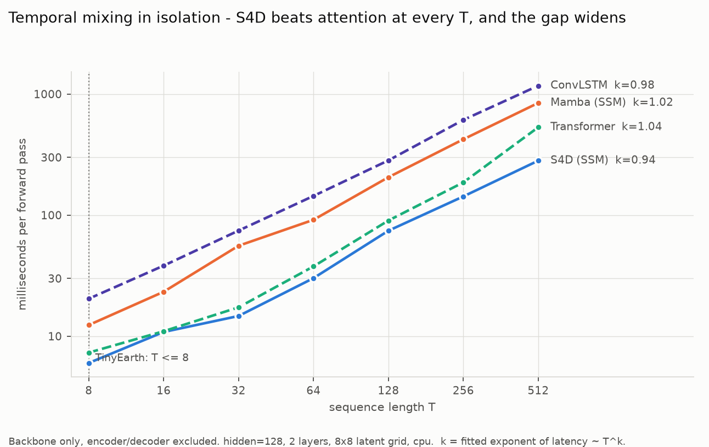
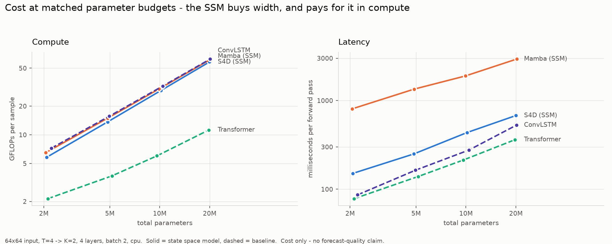

# TinyEarth

**A controlled benchmark for measuring how small a State Space Model can get before it stops
forecasting the Earth's surface competitively.**

Four temporal architectures — a diagonal SSM, a selective SSM, a ConvLSTM and a temporal
transformer — swappable by one config flag, compared at **matched parameter budgets**, with
quality and efficiency measured on every run.

```
image encoder  ─→  temporal backbone  ─→  decoder  ─→  forecast
                   ▲
                   the only thing that changes between experiments
```

The encoder and decoder keep **byte-identical parameter counts** across every backbone swap.
That invariant is what makes a difference attributable to the architecture rather than to
accidental capacity — and it is enforced by tests, not by convention.

```bash
pip install -e ".[dev]"
tinyearth-train +experiment=ssm_smoke      # trains end to end in seconds, no dataset needed
```

---

## Findings

All measured on CPU, dataset-free, reproducible via `scripts/benchmark_efficiency.py` and
`scripts/benchmark_scaling.py`. These are **cost** results; see [Status](#status) for what is
not yet established.

### 1. In isolation, S4D's temporal mixing beats attention at every sequence length

<picture>
  <source media="(prefers-color-scheme: dark)" srcset="docs/figures/mixing-dark.png">
  
</picture>

Measuring the backbone **alone** — the whole point of holding the encoder and decoder fixed —
S4D is the cheapest mixer at every `T`, and the gap over attention widens from **1.2× at
T=8 to 1.9× at T=512**. Fitted latency exponents: S4D `k=0.94`, ConvLSTM `0.98`, Mamba
`1.02`, transformer `1.04`.

Two things worth noticing:

- **Nothing here is quadratic**, not even attention. At `hidden_dim=128` the feed-forward
  term dominates until roughly `T ≈ 4H`; the transformer's FLOPs double at 1.98× per
  doubling of `T` even at 512. The quadratic term shows up first in *wall-clock*
  (2.85× on the last doubling, against S4D's 1.97×) as the attention matrix goes
  memory-bound — before it ever shows up in the FLOP count.
- **Mamba is not in the winning group.** It is an SSM and it is 3× slower than S4D.
  Selectivity without a fused kernel costs more than the architecture class buys.

### 2. But at matched parameters the *whole model* flips the ranking

<picture>
  <source media="(prefers-color-scheme: dark)" srcset="docs/figures/efficiency-dark.png">
  
</picture>

A diagonal SSM's temporal mixing costs `~4HN` parameters against attention's `~4H²`, so at a
2M budget it affords `hidden_dim=272` where the transformer gets 128. But FLOPs scale with
*width squared* in the channel-mixing layers **every** architecture shares. The SSM spends
its parameter saving on width and pays for that width everywhere else: **2.8× the FLOPs and
1.4× the latency** of the transformer at the same parameter count.

So the cheaper mixer loses the full-model comparison. **Parameter efficiency and compute
efficiency are different questions, and here they have opposite answers** — which means
"how small can an SSM be?" does too.

### 3. The SSM's state dimension is cheap in parameters and expensive in compute

`state_dim` is the SSM's own capacity axis, with no ConvLSTM or transformer counterpart.
Growing S4D's state 8→256 (32×) adds only **+1.08M parameters**; reaching the same parameter
increase through width takes just 128→256. But per parameter added, state costs **~4× more
latency than width** (S4D), and **~40× more** for Mamba, whose scan is `O(N)` per step.

The same theme a third time: the two ledgers disagree. `state_dim` is the cheap axis only if
you are counting parameters.

> **Caveat that governs all of this:** TinyEarth's sequences top out at `T=8`, marked on the
> figure. Every architecture is firmly in its linear regime there, and the asymptotic
> argument for SSMs — the usual headline reason to reach for one — is simply absent. Earth
> observation minicubes are short by nature, which may make this an unfavourable setting for
> the architecture. Establishing that is a legitimate result.

---

## What's in here

| | |
| --- | --- |
| **4 temporal backbones** | `s4d`, `mamba`, `convlstm`, `transformer` — one interface, one config flag |
| **Full data pipeline** | EarthNet2021 reader, temporal windowing, cloud masking, deterministic splits, caching |
| **Training stack** | Trainer, optimiser/schedule construction, checkpointing, TensorBoard + JSONL + optional W&B |
| **10 metrics** | MAE, RMSE, PSNR, SSIM, SAM (all mask-aware) + parameters, FLOPs, peak memory, latency, throughput |
| **5 experiment sweeps** | scaling, history length, forecast horizon, hidden dimension, state dimension |
| **Calibrated size tiers** | ~2M / ~5M / ~10M / ~20M, measured per architecture |
| **809 tests** | strict mypy, ruff, black, CI on Linux + Windows |
| **Zero-download demo** | Synthetic data in the real on-disk format — everything runs without the 100 GB dataset |

---

## Why it's a benchmark, not a model zoo

**The comparison is controlled, and the control is tested.** The interface is

```python
encoder:  [B, T, C, H, W] → [B, T, D, h, w]
backbone: [B, T, D, h, w] → [B, K, D, h, w]     # the component under study
decoder:  [B, K, D, h, w] → [B, K, C, H, W]
```

and encoder/decoder hold **no temporal parameters at all** — frames fold into the batch
dimension, so every unit of sequence-modelling capacity belongs to the backbone.

**Efficiency is a first-class result.** Every run reports parameters, FLOPs, peak memory,
latency and throughput by default, with proper CUDA synchronisation and warmup, reported as
a median. No flag to remember — the efficiency numbers are why the project exists.

**Correctness is verified against references, not convergence.** The S4D kernel is checked
against a literal step-by-step recurrence to **1e-7**:

```
x_k = Ā·x_{k-1} + B̄·u_k    ←→    FFT convolution with K_k = C·Ā^k·B̄
```

An SSM with a subtly wrong kernel still trains, still shows a falling loss, and still
produces publishable-looking numbers. Every metric gets the same treatment — tested against
a closed-form value, not a plausible-looking one.

---

## Status

**The platform is complete. The quality experiments have not been run.**

No model has been trained to convergence on real EarthNet2021 data, so there is no
forecast-quality result here. Every quality number in the repo came from synthetic data over
a handful of optimiser steps and is meaningless as science. The cost findings above *are*
real and reproducible.

Producing quality results needs the ~100 GB download and a GPU:

```bash
pip install -e ".[data]"
python scripts/download_earthnet2021.py --root data/earthnet2021

tinyearth-train --multirun +experiment=scaling data=earthnet2021 \
    model=s4d,mamba,convlstm,transformer \
    model.backbone.size=tiny,small,base,large

python scripts/collate_results.py --group scaling
```

Also outstanding: the frozen foundation-encoder comparison, GPU verification of mixed
precision and peak-memory measurement, and validating the EarthNet2021 format constants
against a real download rather than against documentation.

---

## The backbones

| Key | Architecture | Mixes over time by | Parallel in time | Autoregressive |
| --- | --- | --- | --- | --- |
| `s4d` | Diagonal SSM (Gu et al., 2022) | FFT convolution | ✅ | No |
| `mamba` | Selective SSM (Gu & Dao, 2023) | Input-dependent scan | ❌ | No |
| `convlstm` | ConvLSTM (Shi et al., 2015) | Gated recurrence | ❌ | **Yes** |
| `transformer` | Temporal transformer | Attention over `T` | ✅ | No |

`convlstm` is the only autoregressive one — worth stating whenever latency is compared,
since that difference is not about the mixing mechanism.

**Adding a fifth:** subclass `TemporalBackbone`, register it, add a config, run
`scripts/calibrate_sizes.py`, add the name to one list in the tests. The parametrised
interface suite then applies automatically. Nothing else changes.

---

## Commands

```bash
tinyearth-train  +experiment=ssm_smoke      # train end to end
tinyearth-model  --compare                  # size and cost of every backbone, no training
tinyearth-data   +experiment=data_smoke     # build the data pipeline and report on it
tinyearth-info                              # environment and hardware report

python scripts/benchmark_efficiency.py            # cost at matched budgets
python scripts/benchmark_scaling.py --sweep mixing   # cost against sequence length
python scripts/benchmark_scaling.py --sweep state    # cost against SSM state size
python scripts/plot_results.py                       # render the figures above

pytest                                      # 809 tests, ~3 min
pytest -m "not slow"                        # 784 tests, ~28 s
```

Sweeps (add `data=earthnet2021` for real results):

```bash
tinyearth-train --multirun +experiment=scaling        model.backbone.size=tiny,small,base,large
tinyearth-train --multirun +experiment=history_length data.history_length=2,4,6,8
tinyearth-train --multirun +experiment=horizon        data.horizon=1,2,4,8
tinyearth-train --multirun +experiment=hidden_dim     model.backbone.kwargs.hidden_dim=64,128,256,512
tinyearth-train --multirun +experiment=state_dim      model.backbone.kwargs.state_dim=8,16,32,64,128
```

Each run writes `summary.json` (flat, scriptable), `metrics.jsonl`, `resolved_config.yaml`,
`run.log`, checkpoints and TensorBoard events to `outputs/<group>/<name>/`.

---

## Layout

```
configs/                 Hydra tree: data / model / training / experiment
src/tinyearth/
├── models/
│   ├── base.py          Encoder / TemporalBackbone / Decoder interfaces
│   ├── temporal/        ◀── THE COMPONENT UNDER STUDY
│   ├── encoders/        CNN encoder (held fixed)
│   ├── decoders/        CNN decoder (held fixed)
│   ├── losses/          L1, L2, Charbonnier — registry-backed
│   └── sizes.py         calibrated parameter tiers
├── datasets/            EarthNet2021 pipeline, windowing, masking, splits
├── training/            trainer, optimisation, metric tracking
├── evaluation/          forecast-quality and efficiency metrics
├── config/  utils/  cli/
docs/  tests/  scripts/  experiments/  notebooks/
```

`configs/` sits outside the installable package deliberately — research configs are the
experiment record and are edited constantly, so burying them in a wheel is wrong.

---

## Documentation

| Document | Contents |
| --- | --- |
| [`docs/project-log.md`](docs/project-log.md) | **Development history, decisions, and every bug found** |
| [`docs/models.md`](docs/models.md) | Architecture, backbones, measured parameter counts |
| [`docs/evaluation.md`](docs/evaluation.md) | Metrics and how they are measured |
| [`docs/datasets.md`](docs/datasets.md) | Dataset format, splits, masking, normalisation |
| [`docs/reproducibility.md`](docs/reproducibility.md) | Seeding, determinism, and its cost |
| [`docs/configuration.md`](docs/configuration.md) | How the Hydra config system works |
| [`docs/phase-1.md`](docs/phase-1.md) … [`phase-4.md`](docs/phase-4.md) | Per-phase deliverables and verification |
| [`CONTRIBUTING.md`](CONTRIBUTING.md) | Development workflow and coding standards |

---

## Engineering

```bash
black src tests scripts        # format (black is the only formatter)
ruff check src tests scripts   # lint, 17 rule families
mypy                           # strict, 80 source files clean
pytest                         # 809 tests
```

Two data-pipeline conventions are load-bearing and easy to get wrong, so both are tested
aggressively: **`cldmsk == 1` means cloudy** (inverting it trains the model exclusively on
cloud, and the loss still falls), and normalisation statistics must come from the training
split only.

TinyEarth **does not redistribute any dataset**. `data/` is git-ignored, and the default
dataset is synthetic so the repository runs out of the box.

## License

MIT — see [LICENSE](LICENSE).

<details>
<summary>Citations</summary>

```bibtex
@inproceedings{requena2021earthnet2021,
  title     = {EarthNet2021: A Large-Scale Dataset and Challenge for Earth Surface
               Forecasting as a Guided Video Prediction Task},
  author    = {Requena-Mesa, Christian and Benson, Vitus and Reichstein, Markus and
               Runge, Jakob and Denzler, Joachim},
  booktitle = {CVPR Workshops}, year = {2021},
}
@inproceedings{gu2022s4d,
  title     = {On the Parameterization and Initialization of Diagonal State Space Models},
  author    = {Gu, Albert and Gupta, Ankit and Goel, Karan and R{\'e}, Christopher},
  booktitle = {NeurIPS}, year = {2022},
}
@article{gu2023mamba,
  title   = {Mamba: Linear-Time Sequence Modeling with Selective State Spaces},
  author  = {Gu, Albert and Dao, Tri}, journal = {arXiv:2312.00752}, year = {2023},
}
@inproceedings{shi2015convlstm,
  title     = {Convolutional LSTM Network: A Machine Learning Approach for
               Precipitation Nowcasting},
  author    = {Shi, Xingjian and Chen, Zhourong and Wang, Hao and Yeung, Dit-Yan and
               Wong, Wai-Kin and Woo, Wang-chun},
  booktitle = {NeurIPS}, year = {2015},
}
```
</details>
